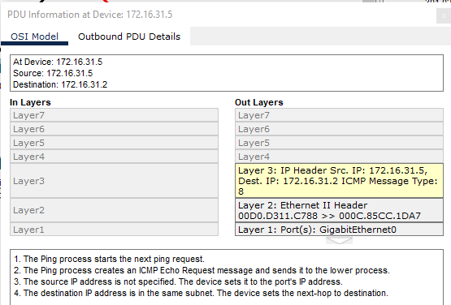
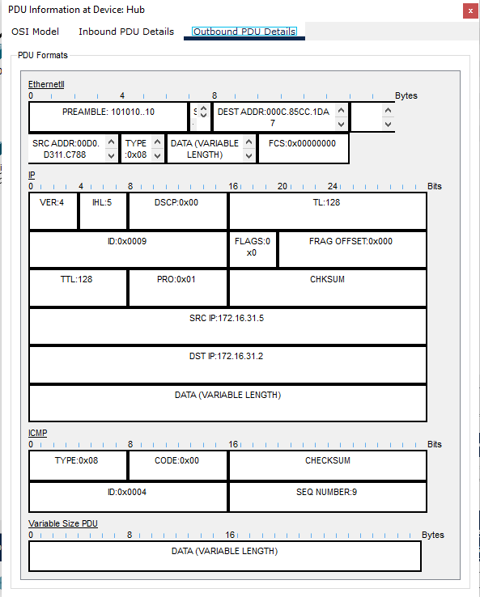

# m145-git-pe22a

# 01_Packet Tracer - Navigate the IOS

- enable: Wechselt in den privilegierten EXEC-Modus.
- configure terminal: Wechselt in den globalen Konfigurationsmodus.
- show clock: Zeigt die aktuelle Systemzeit an.
- clock set: Ermöglicht das Einstellen der Systemzeit.

# 04_Packet Tracer - Identify MAC and IP Addresses

PC 127.16.31.5 `ping 172.16.31.2`

PC 127.16.31.5 `ping 172.16.31.2`
Switch 1 Outbound PDU Details

# Block 05 - 18.03.2025 - VLAN
- Falls keine VLAN ID im Packet definiert an alle VLAN ID's von Sender Port => Send to this Port
- Falls eine VLAN ID im Packet definiert an definierte VLAN ID => Send to this Port
- Falls Receiver Tagged ist und Sender Tagged => Add Tag
- Falls Receiver Tagged ist und Sender Untagged => No Tag
- Falls Receiver Untagged ist und Sender Tagged => No Tag
- Falls Receiver Untagged ist und Sender Untagged => No Tag
